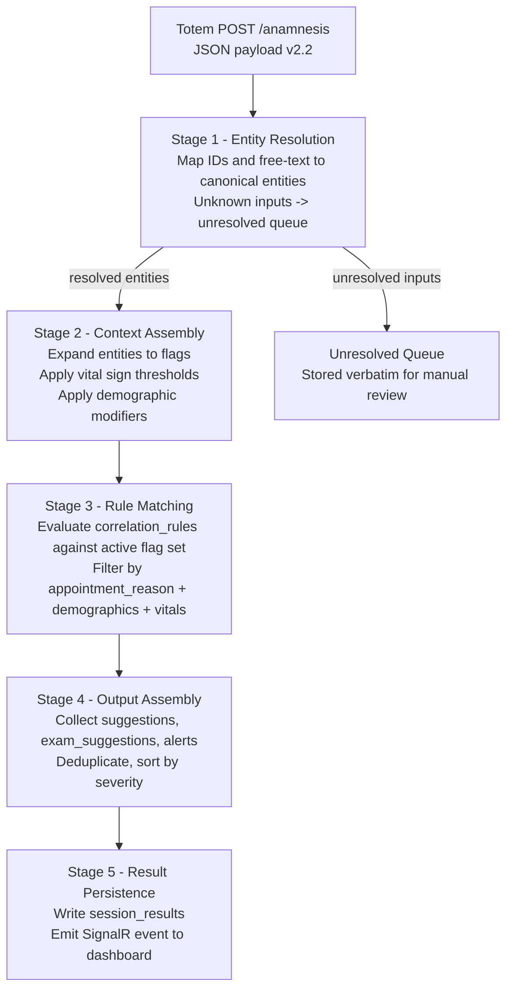
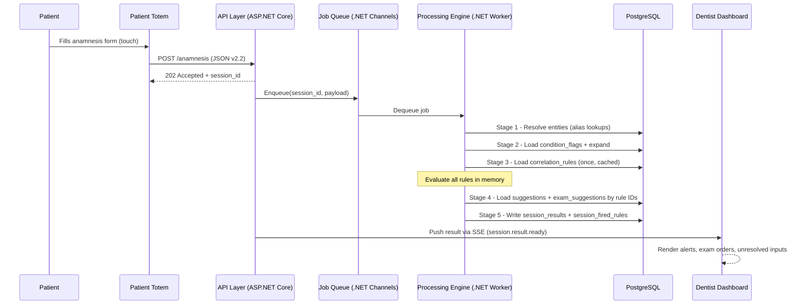
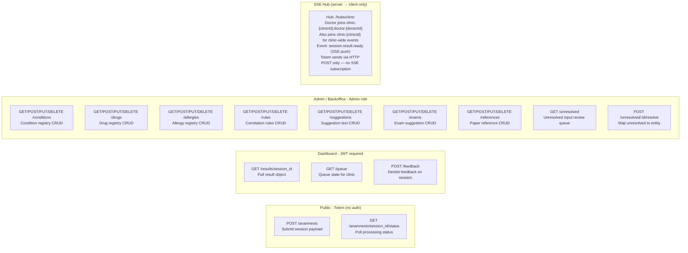
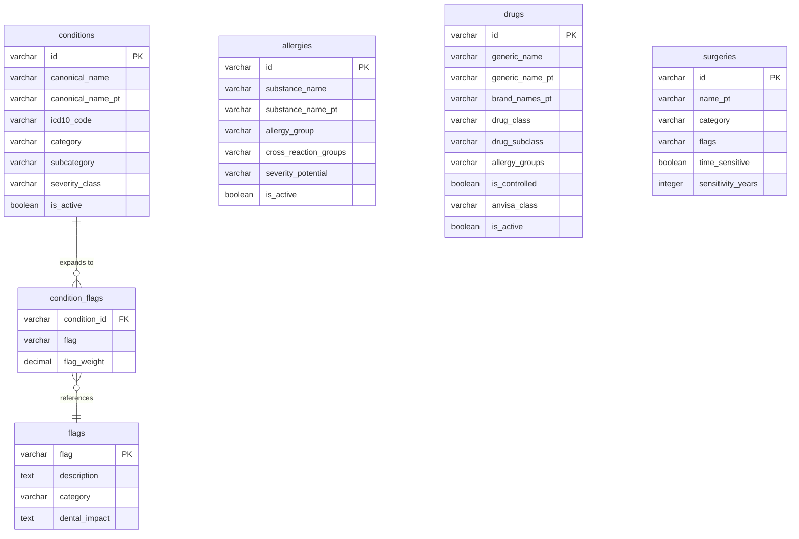
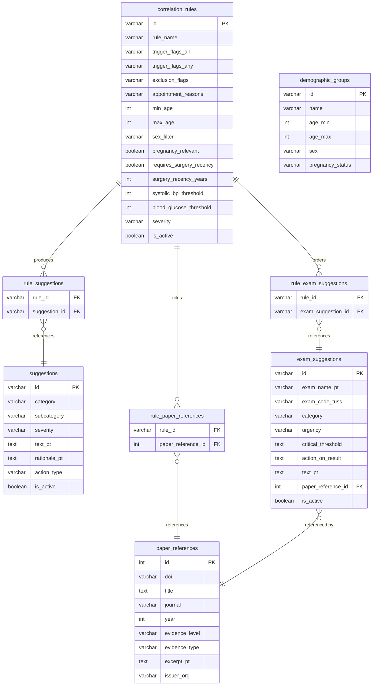
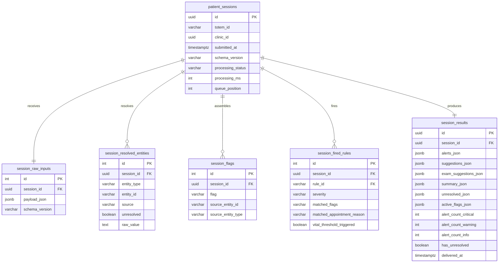
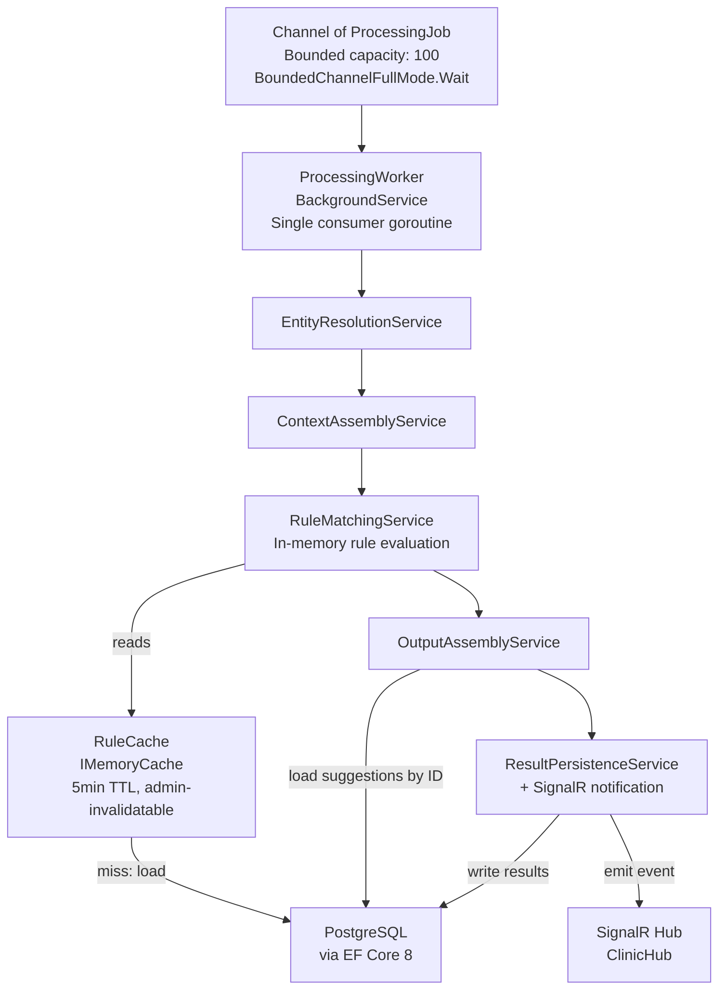
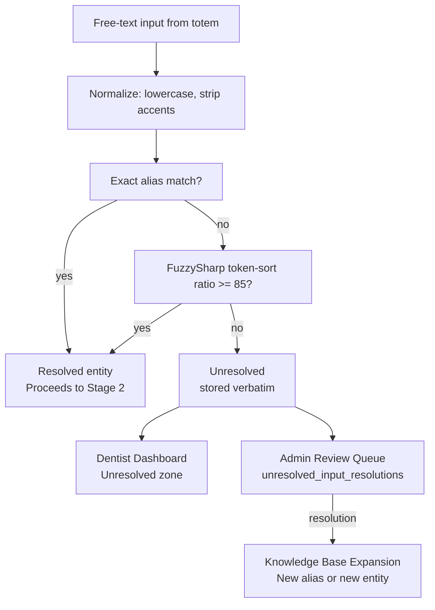
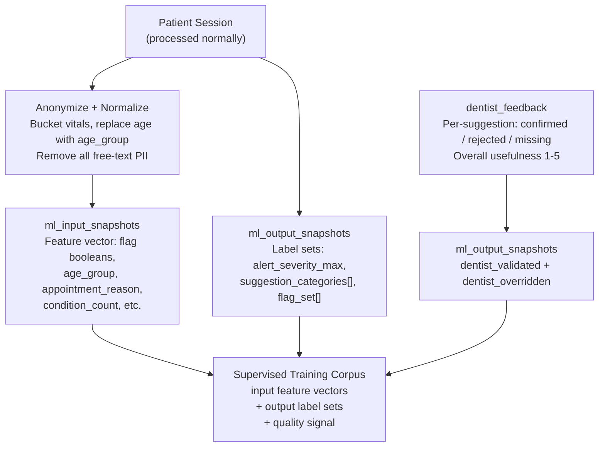

# IAnamnesis — Backend & Algorithm Deep Dive

## Overview

This document covers the complete backend internals: the processing algorithm in full detail, the data model, the API surface, the rule engine design, and the flag taxonomy. It is the companion to [Overall-Architecture.md](Overall-Architecture.md), which covers the system at C4 Level 1–2. This document is C4 Level 3–4 — the internals.

The entire backend is C# / .NET 8. No generative AI is involved in the core product path. Every suggestion, alert, and exam order is a pre-authored row retrieved by deterministic rule evaluation.

---

## Totem Input Contract

The totem POST body is the system's only external input boundary. Everything that follows is deterministic computation over this payload.

### Input Structure (schema_version: 2.2)

The payload is divided into nine clinical sections plus metadata:

```
session metadata          → session identity, timing, schema version
appointment               → reason_category (procedure type) + chief complaint
patient_context           → demographics + vitals (BP, glucose, HR)
conditions[]              → structured IDs + free-text
cardiac_history           → dedicated section (high dental relevance)
bleeding_coagulation      → anticoagulant use, bleeding disorders
respiratory               → asthma, COPD, sleep apnea
neurological_psychiatric  → epilepsy, depression, dementia
renal_hepatic             → CKD, hepatitis, HIV
musculoskeletal           → osteoporosis, bisphosphonate use (BRONJ risk)
endocrine                 → thyroid, adrenal, hormonal therapy
oncology                  → cancer history, radiation head/neck, chemo
allergies[]               → structured IDs + free-text entries
medications[]             → structured IDs + dose/frequency
surgeries[]               → structured IDs + year
free_text_observations[]  → unstructured patient notes
```

The `reason_category` field is **procedure-aware**: it makes the entire rule set context-sensitive. A patient on warfarin coming for a `profilaxia_limpeza` is a different risk profile than the same patient coming for an `extracao`. Rules can filter on appointment context.

Supported reason categories (Brazilian clinical standard):

| Code | Label |
|------|-------|
| `consulta_inicial` | Consulta Inicial |
| `extracao` | Extração |
| `tratamento_canal` | Tratamento de Canal |
| `restauracao` | Restauração |
| `protese` | Prótese |
| `ortodontia` | Ortodontia |
| `implante` | Implante |
| `periodontia` | Periodontia |
| `cirurgia_eletiva` | Cirurgia Eletiva |
| `urgencia_dor` | Urgência — Dor |
| `urgencia_trauma` | Urgência — Trauma |
| `urgencia_infeccao` | Urgência — Infecção |
| `retorno_pos_operatorio` | Retorno Pós-Operatório |
| `profilaxia_limpeza` | Profilaxia / Limpeza |
| `clareamento` | Clareamento |
| `avaliacao_exame` | Avaliação / Exame |

### `patient_context` — Vitals Detail (schema_version 2.2)

Most patients know whether they *have* a condition, but not their specific measured values. The vitals section therefore uses a **three-state input model** for blood pressure and blood glucose, capturing what the patient actually knows rather than leaving fields blank.

**Blood pressure:**

```
blood_pressure:
  input_mode           → required enum: "measured" | "condition_known" | "unknown"
  systolic_bp          → integer 60–300  (required if input_mode = "measured")
  diastolic_bp         → integer 60–300  (required if input_mode = "measured")
  has_hypertension     → boolean         (required if input_mode = "condition_known")
```

**Blood glucose:**

```
blood_glucose:
  input_mode           → required enum: "measured" | "condition_known" | "unknown"
  fasting_value        → integer 20–600  (required if input_mode = "measured")
  has_diabetes         → boolean         (required if input_mode = "condition_known")
```

**Other vitals (unchanged):**

```
heart_rate             → optional integer
is_pregnant            → optional boolean
is_smoker              → optional boolean
```

**Totem UX — blood pressure screen:**
- "Did you check your blood pressure recently?"
  - "Yes — I know my numbers" → numeric inputs (systolic / diastolic)
  - "I know whether I have hypertension, but not the numbers" → Yes / No toggle
  - "I've never checked / I don't know" → no further input needed

The blood glucose screen follows the same three-choice pattern for diabetes.

`input_mode = "unknown"` is clinically distinct from simply omitting the field — it explicitly signals that the patient has *never had these values checked*, which triggers different exam recommendation rules (see Stage 2 and Flag Taxonomy below).

---

## Processing Pipeline — All Five Stages



### Stage 1 — Entity Resolution

**Input:** raw totem payload  
**Output:** `session_resolved_entities` rows + unresolved passthrough list

Each entity in the payload arrives in one of two forms:

- **Structured** (`source: "structured"`) — carries a canonical ID (`cond_diabetes_t2`, `drug_warfarin`). These are direct lookups against the registry tables. Zero ambiguity.
- **Free-text** (`source: "free_text"`) — raw patient text. Runs through the fuzzy matcher.

**Resolution algorithm for free-text:**

```
1. Normalize input: lowercase, strip accents, trim punctuation
2. Exact match against aliases tables (conditions.aliases, drugs.brand_names_pt)
3. If no exact match: FuzzySharp token-sort ratio ≥ 85 → accept
4. If no fuzzy match: flag as unresolved, store raw value verbatim
```

**Unresolved inputs are never silently dropped.** They are stored in `session_resolved_entities` with `unresolved = true` and surfaced to the dentist in a dedicated visual zone.

Stage 1 also resolves cross-section relationships:
- `musculoskeletal.bisphosphonate_ids[]` → resolves each drug ID
- `bleeding_coagulation.anticoagulant_ids[]` → resolves each drug ID
- `cardiac_history.conditions[]` → resolves condition IDs

### Stage 2 — Context Assembly

**Input:** resolved entity list  
**Output:** `session_flags` rows — a flat boolean flag set representing the patient's full clinical profile

This stage expands every resolved entity into its associated flags via the `condition_flags` table, `drugs.allergy_groups`, and `allergies.cross_reaction_groups`, then applies vital sign and demographic rules directly.

**Vital sign flags (hardcoded — not authored rules):**

Blood pressure and blood glucose produce flags via one of three paths determined by `input_mode`.

**Numeric path (`input_mode = "measured"`):**

| Condition | Flag |
|-----------|------|
| `systolic_bp >= 180` OR `diastolic_bp >= 110` | `hypertensive_crisis` |
| `systolic_bp >= 140` OR `diastolic_bp >= 90` | `hypertension_stage2` |
| `fasting_value >= 200` | `diabetes_uncontrolled` |
| `fasting_value >= 126` | `diabetes_elevated` |

These thresholds follow ANVISA / SBC / SBD clinical guidelines and carry full severity grading.

**Self-reported path (`input_mode = "condition_known"`):**

| Condition | Flag |
|-----------|------|
| `has_hypertension == true` | `hypertension_self_reported` |
| `has_hypertension == false` | *(no flag)* |
| `has_diabetes == true` | `diabetes_self_reported` |
| `has_diabetes == false` | *(no flag)* |

Self-reported flags carry no numeric severity grade. They trigger conservative precautions and generate "measure before procedure" exam suggestions on invasive appointments.

**Unknown path (`input_mode = "unknown"`):**

| Condition | Flag |
|-----------|------|
| blood pressure | `blood_pressure_unknown` |
| blood glucose | `blood_glucose_unknown` |

Unknown flags signal that no BP or glucose data is available and the condition has never been checked. Rules targeting these flags recommend ordering the relevant exam before any invasive procedure — this is the most safety-critical state for surgical planning.

**These paths are additive to `conditions[]`.** If a patient also lists `cond_hypertension` in the conditions section, those entity-derived flags (`vasoconstrictor_caution`, `antihypertensive_active`) still apply independently. The vitals three-state path adds *measurement-context* flags on top.

**Demographic and other thresholds (unchanged):**

| Condition | Flag |
|-----------|------|
| `age >= 65` | `elderly` |
| `age <= 12` | `pediatric` |
| `is_pregnant == true` | `pregnancy` |
| `is_smoker == true AND appointment == implante` | `implant_smoking_risk` |
| `bisphosphonate_duration_years >= 3` | `bronj_high_risk` |
| `radiation_head_neck == true` | `osteoradionecrosis_risk` |
| `anticoagulant_active AND appointment IN [extracao, cirurgia_eletiva, implante]` | `perioperative_bleeding_risk` |
| `hepatitis.resolved == false` | `active_hepatitis_risk` |

**Entity-to-flag expansion** is driven by `condition_flags`:

```
cond_diabetes_t2       → healing_impairment, infection_risk, vasoconstrictor_caution
cond_hypertension      → vasoconstrictor_caution, antihypertensive_active
drug_warfarin          → anticoagulant_active, bleeding_risk
drug_alendronato       → bisphosphonate_use
allergy_penicillin     → beta_lactam_allergy
allergy_dipyrone       → nsaid_allergy
surg_cardiac_bypass    → cardiac_history
```

At the end of Stage 2, the engine has a flat, deduplicated flag set. This is the only representation the rule engine reads — it does not re-query entity tables.

### Stage 3 — Rule Matching

**Input:** active flag set + session metadata  
**Output:** list of fired `correlation_rules`

Each rule in `correlation_rules` is evaluated as:

```
FIRES if:
  ALL flags in trigger_flags_all are present in active flag set
  AND AT LEAST ONE flag in trigger_flags_any is present (if list is non-empty)
  AND NONE of the flags in exclusion_flags are present
  AND (appointment_reasons is empty OR session.appointment_reason IN appointment_reasons)
  AND (min_age is null OR patient.age >= min_age)
  AND (max_age is null OR patient.age <= max_age)
  AND (sex_filter == 'any' OR patient.sex == sex_filter)
  AND (pregnancy_relevant == false OR patient.is_pregnant == true)
  AND (requires_surgery_recency == false OR surgery_elapsed_years <= surgery_recency_years)
  AND (systolic_bp_threshold is null OR (blood_pressure.input_mode = "measured" AND patient.blood_pressure.systolic_bp >= systolic_bp_threshold))
  AND (blood_glucose_threshold is null OR (blood_glucose.input_mode = "measured" AND patient.blood_glucose.fasting_value >= blood_glucose_threshold))
```

All conditions are evaluated in memory over the flat flag set. No join queries at rule evaluation time.

**Rule severity hierarchy:** `CRITICAL > WARNING > INFO`

If the same output suggestion is produced by multiple fired rules, the highest severity wins.

### Stage 4 — Output Assembly

**Input:** fired rule list  
**Output:** structured result object ready for delivery

For each fired rule, the engine collects:
- `suggestions[]` via `rule_suggestions` junction
- `exam_suggestions[]` via `rule_exam_suggestions` junction
- `alerts[]` — synthesized from rule metadata + paper references

Deduplication: if the same suggestion ID appears in multiple fired rules, include it once at the highest severity.

Sort order:
1. Alerts: `CRITICAL` first, then `WARNING`, then `INFO`
2. Exam suggestions: `before_procedure` first, then `at_next_visit`, then `routine`
3. Suggestions: by severity, then by category (`anesthesia > medication_restriction > post_procedure > monitoring`)

The final result also includes:
- `patient_context` summary (resolved conditions, allergies, medications, vitals)
- `unresolved_passthrough[]` — verbatim unresolved inputs for manual dentist review
- `active_flags[]` — complete flag set for audit trail

### Stage 5 — Result Persistence and Delivery

**Input:** assembled result object  
**Output:** `session_results` row written + SignalR event emitted



**Rule cache:** `correlation_rules` are loaded once at worker startup and held in memory. The cache is invalidated on a configurable interval (default: 5 minutes) or on explicit admin signal. This avoids per-session DB round-trips for the rule set, which changes infrequently.

---

## Flag Taxonomy

Flags are the shared vocabulary between Stage 2 (entity expansion) and Stage 3 (rule matching). The medical team authors rules in terms of flags — not raw entity IDs. This decouples the knowledge base from the entity registry.

### Anesthesia Flags

| Flag | Trigger | Dental Impact |
|------|---------|---------------|
| `vasoconstrictor_caution` | Hypertension, uncontrolled DM, cardiac history, hyperthyroidism | Limit epinephrine to 1:200,000 max 2 carpules; avoid felypressin |
| `vasoconstrictor_contraindicated` | Pheochromocytoma, unstable angina, recent MI < 6mo | No vasoconstrictor at all |
| `anesthesia_caution_hepatic` | Active liver disease, cirrhosis | Reduced amide local anesthetic metabolism |

### Bleeding / Coagulation Flags

| Flag | Trigger | Dental Impact |
|------|---------|---------------|
| `anticoagulant_active` | Warfarin, rivaroxaban, apixaban, dabigatran | INR check before surgery |
| `antiplatelet_active` | Aspirin, clopidogrel, ticagrelor | Bleeding risk in invasive procedures |
| `bleeding_risk` | Hemophilia, von Willebrand, thrombocytopenia | Factor replacement may be needed |
| `perioperative_bleeding_risk` | anticoagulant_active + invasive appointment | Critical — INR required before procedure |

### Healing / Infection Flags

| Flag | Trigger | Dental Impact |
|------|---------|---------------|
| `healing_impairment` | DM (any), corticosteroids, immunosuppressants, malnutrition | Slower healing, higher infection risk post-op |
| `infection_risk` | DM uncontrolled, immunosuppressed, CKD, active HIV | Prophylactic antibiotic consideration |
| `immunosuppressed` | HIV, chemotherapy, transplant medications, high-dose steroids | Opportunistic infection risk; avoid elective procedures if active |

### Osteonecrosis Flags

| Flag | Trigger | Dental Impact |
|------|---------|---------------|
| `bisphosphonate_use` | Any bisphosphonate | Increased BRONJ/MRONJ risk with invasive procedures |
| `bronj_high_risk` | bisphosphonate_duration_years >= 3 | High MRONJ risk — panoramic X-ray mandatory before extraction |
| `osteoradionecrosis_risk` | Radiation to head/neck | No invasive procedure without oral surgery consult |
| `denosumab_use` | Denosumab (anti-RANKL) | Similar osteonecrosis risk to bisphosphonates |

### Cardiovascular Flags

| Flag | Trigger | Dental Impact |
|------|---------|---------------|
| `cardiac_history` | Cardiac surgery in past 5 years, MI, severe arrhythmia | Cardiologist clearance before invasive procedures |
| `pacemaker_present` | pacemaker == true | Avoid ultrasonic scalers; EMI precaution |
| `hypertension_stage2` | SBP >= 140 or DBP >= 90 (measured) | Monitor BP; limit vasoconstrictor |
| `hypertensive_crisis` | SBP >= 180 or DBP >= 110 (measured) | Defer all elective procedures |
| `hypertension_self_reported` | `has_hypertension == true` (no numeric data) | Vasoconstrictor limit; BP measurement required before invasive procedures |
| `blood_pressure_unknown` | `blood_pressure.input_mode == "unknown"` | BP never checked; measure before any invasive procedure; exam order triggered |
| `endocarditis_risk` | Prosthetic valve, prior endocarditis, congenital heart disease | Antibiotic prophylaxis (AHA protocol) |

### Endocrine / Metabolic Flags

| Flag | Trigger | Dental Impact |
|------|---------|---------------|
| `diabetes_elevated` | Fasting glucose >= 126 mg/dL (measured) | Healing and infection precautions; exam recommended |
| `diabetes_uncontrolled` | Fasting glucose >= 200 mg/dL (measured) | Defer elective invasive procedures; HbA1c required |
| `diabetes_self_reported` | `has_diabetes == true` (no numeric data) | Healing and infection precautions; fasting glucose exam required before invasive procedures |
| `blood_glucose_unknown` | `blood_glucose.input_mode == "unknown"` | Glucose never checked; fasting glucose exam required before invasive procedures; dentist alert |

### Allergy / Drug Flags

| Flag | Trigger | Dental Impact |
|------|---------|---------------|
| `beta_lactam_allergy` | Penicillin, amoxicillin, cephalosporins | Use clindamycin or azithromycin as alternative |
| `nsaid_allergy` | Dipyrone, ibuprofen, aspirin allergy | Use paracetamol for analgesia |
| `latex_allergy` | latex allergy | Latex-free gloves and equipment mandatory |
| `local_anesthetic_allergy` | lidocaine or articaine allergy | Specialist referral — rare but critical |
| `antidepressant_active` | SSRIs, SNRIs, TCAs | Tramadol interaction (serotonin syndrome risk) |
| `antihypertensive_active` | ACE inhibitors, ARBs, beta-blockers, calcium channel blockers | Vasoconstrictor limit; orthostatic hypotension precaution |

### Demographic Flags

| Flag | Trigger | Dental Impact |
|------|---------|---------------|
| `pregnancy` | is_pregnant == true | 2nd trimester window; avoid unnecessary X-rays; lidocaine without vasoconstrictor first choice |
| `elderly` | age >= 65 | Polypharmacy risk; reduced drug metabolism; dry mouth (xerostomia) |
| `pediatric` | age <= 12 | Drug dose adjustment; parent/guardian consent |
| `implant_smoking_risk` | smoker + implante appointment | Elevated implant failure rate; informed consent required |

---

## API Surface

### Endpoints



### POST /anamnesis

Accepts the full totem JSON payload. Returns `202 Accepted` immediately. Does not wait for processing.

**Response:**
```json
{
  "session_id": "uuid",
  "status": "pending",
  "estimated_processing_ms": 150
}
```

Validation (FluentValidation):
- `session_id` must be UUID v4
- `schema_version` must match server-supported versions
- `appointment.reason_category` must be a known code
- `patient_context.age` must be in range 1–120
- `blood_pressure.input_mode` required; must be `"measured"` | `"condition_known"` | `"unknown"`
- `blood_pressure.systolic_bp` required if `input_mode = "measured"`; range 60–300
- `blood_pressure.diastolic_bp` required if `input_mode = "measured"`; range 60–300
- `blood_pressure.has_hypertension` required if `input_mode = "condition_known"`
- `blood_glucose.input_mode` required; must be `"measured"` | `"condition_known"` | `"unknown"`
- `blood_glucose.fasting_value` required if `input_mode = "measured"`; range 20–600
- `blood_glucose.has_diabetes` required if `input_mode = "condition_known"`

Validation errors return `400 Bad Request` with a structured error body. The totem displays a retry prompt.

### GET /queue (Dashboard)

Returns the current queue state for the connected clinic, ordered by `queue_position`:

```json
{
  "clinic_id": "uuid",
  "queue": [
    {
      "session_id": "uuid",
      "totem_id": "clinic-a-totem-2",
      "queue_position": 1,
      "status": "processing",
      "appointment_reason": "extracao",
      "appointment_reason_label": "Extração",
      "alert_badge": "CRITICAL",
      "check_in_time": "2025-06-08T14:32:00-03:00"
    }
  ]
}
```

`alert_badge` is populated after processing completes (`CRITICAL`, `WARNING`, `INFO`, `OK`, `UNRESOLVED_ONLY`). The dashboard uses this to color-code the queue list.

### SSE Hub: /hubs/clinic

SSE is server-to-client only. The dentist dashboard opens an SSE connection and joins two groups using hierarchical composite keys:

- `clinic:{clinicId}` — clinic-wide scope (admin broadcasts, queue state)
- `clinic:{clinicId}:doctor:{doctorId}` — doctor-scoped scope (receives `session.result.ready`)

The server emits `session.result.ready` with the full result object to the doctor's group when Stage 5 completes. The dashboard renders alerts immediately without a polling GET.

The totem never connects to this hub — it sends via `POST /anamnesis` only and optionally polls `GET /anamnesis/{session_id}/status`. The `clinicId` is always injected server-side from the authenticated identity; it is never trusted from the client payload.

---

## Data Model

### Entity Registry (Knowledge Base)



### Knowledge Base (Rules and References)



### Session and Result Tables



---

## Processing Engine Internals

The engine is a `BackgroundService` (.NET Worker Service) hosting a single consumer loop over a `System.Threading.Channels.Channel<ProcessingJob>`.



### Rule Cache

`correlation_rules` (plus their joined `rule_suggestions`, `rule_exam_suggestions`, `rule_paper_references`) are loaded at startup and cached as a `List<CompiledRule>` in `IMemoryCache`.

`CompiledRule` is a pre-parsed in-memory object: the `trigger_flags_all`, `trigger_flags_any`, and `exclusion_flags` are stored as `HashSet<string>` for O(1) flag intersection.

Cache invalidation:
- TTL: 5 minutes (configurable via `appsettings.json`)
- Explicit: `POST /admin/rules/cache/invalidate` — called by the backoffice after any rule edit

### EF Core Design Notes

- **Code-first migrations** — schema is the source of truth in C#
- **No lazy loading** — all navigation properties loaded explicitly to avoid N+1
- **Session tables use `AsNoTracking()`** — read-only query paths skip change tracker overhead
- **Rule loading uses a single query with `.Include()` chains** — avoids separate queries per rule
- **JSONB columns** (`alerts_json`, `suggestions_json`, etc.) mapped as `JsonDocument` or typed C# records via EF Core `ToJson()` (EF 8)

### Concurrency

The channel is bounded at 100 jobs. Under normal single-clinic pilot conditions, the queue never approaches this limit — processing takes ~50–150ms per session.

If the worker is processing and the channel is at capacity, `POST /anamnesis` will block on `WriteAsync` with a timeout. After timeout, the API returns `503 Service Unavailable` with a `Retry-After` header.

For multi-clinic scale (Phase 3), the channel is replaced by MassTransit + RabbitMQ. The service interfaces (`IEntityResolutionService`, `IRuleMatchingService`, etc.) remain unchanged — the transport layer is swapped beneath them.

---

## Critical Rule Examples (Brazilian Dental Context)

These are the highest-priority rules for the pilot knowledge base. Each is a direct translation of CFO/ADA/SBC guidelines into the rule engine's condition format.

| Rule ID | Trigger Flags | Appointment Filter | Output Type | Severity |
|---------|--------------|-------------------|-------------|----------|
| `RULE_E001` | `perioperative_bleeding_risk` | extracao, implante, cirurgia_eletiva | Exam: TP/INR + TTPA | CRITICAL |
| `RULE_E002` | `diabetes_uncontrolled` | extracao, implante, cirurgia_eletiva, tratamento_canal | Exam: Glicemia Jejum + HbA1c | WARNING |
| `RULE_E003` | `bronj_high_risk` | extracao, implante, cirurgia_eletiva, periodontia | Exam: Panorâmica + CT (if implante) | CRITICAL |
| `RULE_E004` | `cardiac_history` + surgery_recency ≤ 5y | extracao, cirurgia_eletiva, implante | Exam: ECG + Coagulograma | CRITICAL |
| `RULE_E005` | `healing_impairment` + `infection_risk` | extracao, implante, periodontia | Exam: Hemograma completo | WARNING |
| `RULE_E006` | `osteoradionecrosis_risk` | any | Exam: CT + Biopsy if lesion | CRITICAL |
| `RULE_E007` | `hypertension_stage2` OR `diabetes_elevated` | consulta_inicial, avaliacao_exame | Exam: BP measurement + capillary glucose | WARNING |
| `RULE_E008` | `pregnancy` | any | Suggestion: 2nd trimester window, X-ray protocol | WARNING |
| `RULE_A001` | `beta_lactam_allergy` | any | Suggestion: clindamycin/azithromycin alternative | CRITICAL |
| `RULE_A002` | `nsaid_allergy` | any | Suggestion: paracetamol for analgesia | WARNING |
| `RULE_A003` | `antidepressant_active` | any | Suggestion: avoid tramadol (serotonin syndrome) | WARNING |
| `RULE_V001` | `vasoconstrictor_caution` | any | Suggestion: limit epinephrine 1:200,000 max 2 carpules | WARNING |
| `RULE_V002` | `hypertensive_crisis` | any | Alert: defer all elective procedures | CRITICAL |
| `RULE_V003` | `hypertension_self_reported` | extracao, implante, cirurgia_eletiva, periodontia | Exam: Medição de PA antes do procedimento | WARNING |
| `RULE_V004` | `blood_pressure_unknown` | any | Alert: PA não verificada — medir antes de qualquer procedimento invasivo | WARNING |
| `RULE_C001` | `endocarditis_risk` | extracao, periodontia, implante, tratamento_canal | Suggestion: AHA antibiotic prophylaxis protocol | CRITICAL |
| `RULE_B001` | `bronj_high_risk` + `bisphosphonate_use` | extracao | Suggestion: MRONJ protocol, surgeon consult | CRITICAL |
| `RULE_D001` | `diabetes_self_reported` | extracao, implante, cirurgia_eletiva, tratamento_canal | Exam: Glicemia em Jejum antes do procedimento | WARNING |
| `RULE_D002` | `blood_glucose_unknown` | extracao, implante, cirurgia_eletiva, tratamento_canal | Exam: Glicemia em Jejum + Alerta para dentista revisar | WARNING |

---

## Output Object — Full Structure

The result delivered to the dashboard covers seven top-level sections:

```
queue_meta           → totem identity, clinic, check-in time, alert badge
patient_context      → age group, sex, pregnancy, smoking, vitals (bucketed)
alerts[]             → critical/warning items with triggered_by + paper_ref
suggestions[]        → clinical guidance text with category + rationale
exam_suggestions[]   → lab/imaging orders with TUSS code + critical_threshold
summary              → resolved entities (conditions, allergies, medications, surgeries, vitals)
unresolved_passthrough[] → verbatim inputs that couldn't be mapped, with display_note
active_flags[]       → complete flag set for audit
```

**Unresolved passthrough** is the only section where raw patient text reaches the dentist's screen. It is rendered in a dedicated, visually distinct zone — not mixed with algorithm-generated alerts.

---

## Unresolved Input Handling



The review queue is the organic knowledge base growth mechanism. Every unresolved input is a candidate for a new alias, a new entity, or a new rule. No ML required — the team reviews, maps, and the next patient with the same input gets automated analysis.

---

## Technology Stack — Detail

### Backend

| Layer | Technology | Notes |
|-------|-----------|-------|
| API Framework | ASP.NET Core 8 Minimal APIs | Endpoint groups by domain; no controllers |
| Background Worker | .NET Worker Service | Single `BackgroundService`, `Channel<T>` queue |
| ORM | EF Core 8 | Code-first; PostgreSQL provider; `ToJson()` for JSONB columns |
| Database | PostgreSQL 16 | JSONB for session blobs; `VARCHAR[]` for flag arrays |
| Real-time | ASP.NET Core SignalR (SSE transport) | SSE server-to-client only; hierarchical group keys (`clinic:{id}`, `clinic:{id}:doctor:{id}`); HTTP POST for totem-to-server direction |
| Input Matching | FuzzySharp | Token-sort ratio; extensible to Lucene.NET for larger corpus |
| Validation | FluentValidation | Endpoint-level validators; custom rule for known reason codes |
| Auth | ASP.NET Core Identity + JWT | Clinic-scoped tokens; `clinic_id` claim on every request |
| Caching | IMemoryCache | Rule cache; per-process; no distributed cache in pilot |
| Testing | xUnit + Testcontainers | PostgreSQL in Docker for integration tests; no mock DB |
| Logging | Serilog → stdout | Structured JSON logs; Docker log driver handles aggregation |
| Health Checks | ASP.NET Core Health Checks | `/health/live`, `/health/ready`; PostgreSQL connectivity check |

### Frontend — Android (Totem)

The totem runs Flutter on Android hardware. Target devices: **Gertec SK210** or **Elgin MK21** (one selected for pilot).

| Layer | Technology | Notes |
|-------|-----------|-------|
| Framework | Flutter (Dart) | Native Android; single codebase; touch-optimized kiosk UI |
| HTTP client | `dio` / `http` | `POST /anamnesis` to submit form; polls `GET /anamnesis/{session_id}/status` for result readiness |
| Kiosk lockdown | Android dedicated-device mode | Flutter `SystemChrome.setEnabledSystemUIMode` for full-screen; no browser layer |
| Real-time | None (no SSE on totem) | Totem only sends — SSE subscription is the dentist dashboard's concern |
| Auth | No JWT | Clinic-trusted network; totem identified by `totem_id` in payload |

### Frontend — Web (Dentist Dashboard + Backoffice)

Both views run in the **browser on the doctor's own hardware** (workstation or laptop at the clinic). No installation required on the doctor's machine.

| Layer | Technology | Notes |
|-------|-----------|-------|
| UI Framework | React + TypeScript (Vite) | Dentist dashboard and admin backoffice as separate React apps (or routes) |
| SSE Client | `@microsoft/signalr` (npm) | Dashboard subscribes to `session.result.ready` via SSE on connect; joins `clinic:{clinicId}` and `clinic:{clinicId}:doctor:{doctorId}` groups |
| State management | React Context + hooks | Queue list, active result, unresolved panel; Zustand if complexity grows |
| Auth | JWT (Bearer) | `clinic_id` claim; backoffice requires admin role |

### Infrastructure (Pilot)

| Concern | Technology | Notes |
|---------|-----------|-------|
| Containerization | Docker + Docker Compose | Single-server; all services in one `docker-compose.yml` |
| Reverse Proxy | Nginx | TLS termination; SSE proxy for real-time push events |
| Database | PostgreSQL 16 in Docker | Volume-mounted data dir; daily `pg_dump` backup |
| CI | GitHub Actions | Build + test on PR; Docker image push on main |

---

## ML Training Data Architecture

> This section is secondary to the core product. The rule engine ships and validates first. ML investment is Phase 3, contingent on pilot proving clinical value.

Every processed session automatically populates two training tables without affecting the main processing path:



### What Gets Captured

**Input features (`ml_input_snapshots`):**
- Demographics: `age_group`, `sex`, `is_pregnant`, `is_smoker`
- Appointment: `appointment_reason`, `pain_present`, `pain_scale`
- Vitals bucketed: `bp_category` (normal/elevated/stage1/stage2/crisis), `glucose_category`
- Flag booleans: 17 pre-defined flag columns covering the most common Brazilian dental risk scenarios
- Aggregate counts: `condition_count`, `medication_count`, `allergy_count`, `unresolved_count`
- Full anonymized `feature_vector_json` for reconstruction

**Output labels (`ml_output_snapshots`):**
- `alert_severity_max` — the highest severity that fired (`CRITICAL`, `WARNING`, `INFO`, `NONE`)
- `suggestion_categories[]` — which categories appeared in the output
- `exam_categories[]` — which exam types were ordered
- `flag_set[]` — the complete active flag set (the "reasoning trace")

### The Training Signal

When a dentist marks a suggestion as `rejected` or notes a `missing` suggestion, this populates `dentist_validated = false` / `dentist_overridden = true` on the corresponding `ml_output_snapshots` row. Over time this gives you a quality-weighted supervised dataset.

### What ML Could Replace (Phase 3)

- **Input normalization only** — replace the FuzzySharp alias matcher with an embedding-based similarity model trained on Portuguese clinical text. This improves unresolved input resolution rates without touching the rule engine.
- **Flag enrichment** — a classifier that predicts additional flags from free-text `chief_complaint_free` and `free_text_observations`. The rule engine remains unchanged; ML only expands the flag set fed into Stage 3.

**ML does not replace the rule engine.** Suggestions remain pre-authored. Exam orders remain pre-authored. The model assists with input understanding, not clinical output generation.

### When ML Becomes Viable

The training corpus becomes useful when:
- ~5,000 sessions with dentist feedback collected (quality signal density)
- ~500 distinct unresolved inputs resolved by the medical team (normalization training set)
- Rule engine output has been validated and iterated by the medical team over Phase 1–2

At that point, the Phase 3 ML investment is grounded in real clinical data from the same patient population the model will serve.

---

## What the Medical Team Must Deliver Before Code

The algorithm is straightforward. The knowledge base is the product. Before any code ships, the medical team must produce:

1. **Flag taxonomy** — 30–40 flags covering the Brazilian dental risk landscape (a superset of the table in this document)
2. **Condition registry seed** — 20+ conditions with `condition_flags` mappings, Portuguese aliases, ICD-10 codes
3. **Drug registry seed** — 50+ drugs with `allergy_groups`, `brand_names_pt`, ANVISA class, known interactions
4. **Allergy registry seed** — 15+ allergy groups with `cross_reaction_groups`
5. **Correlation rules** — 60–80 rules covering the most common systemic conditions in Brazilian clinics, authored in the flag condition format above
6. **Exam suggestion catalogue** — TUSS codes, `critical_threshold` values, Portuguese text
7. **Suggestion text catalogue** — pre-authored in clinical Portuguese, reviewed by a dentist

The software retrieves. The medical team decides what gets retrieved.
