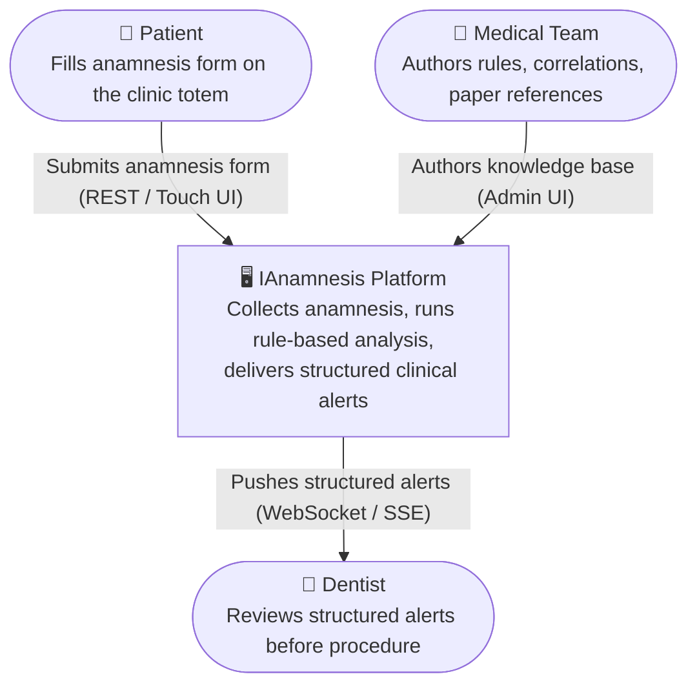
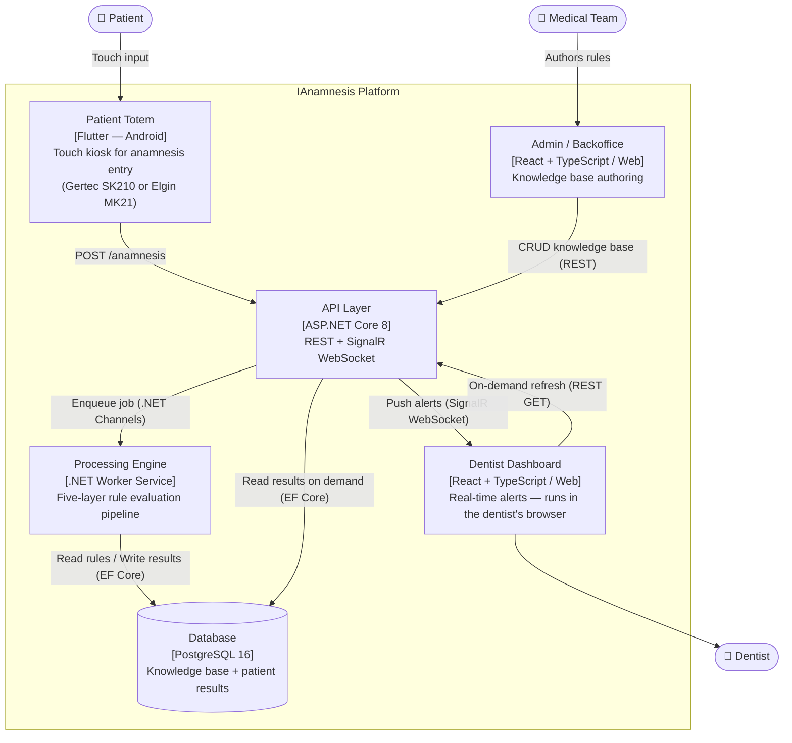
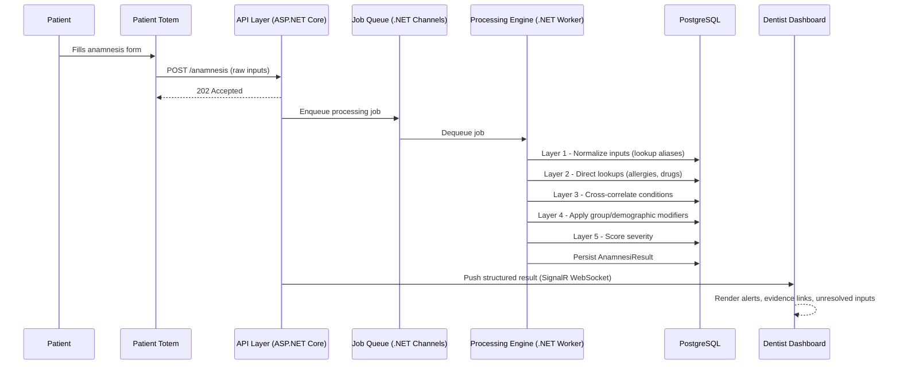
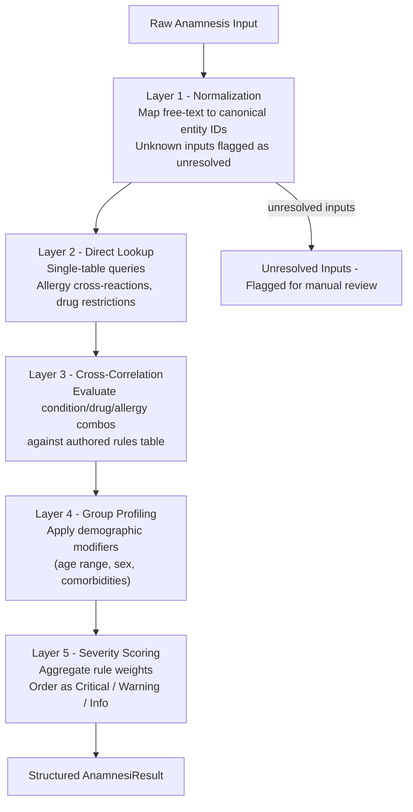
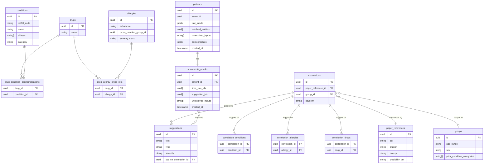

# IAnamnesis — Overall Architecture

## Purpose

IAnamnesis is a clinical decision **support** tool for dentistry. It receives patient anamnesis data from a patient-facing totem, processes it through a deterministic rule engine backed by a curated medical knowledge base, and surfaces structured, evidence-linked alerts to the dentist before treatment begins.

**The system supports clinical decisions. It does not make them.** Every output is pre-authored by the medical team and traceable to a peer-reviewed source. The software is retrieval infrastructure; the medical knowledge base is the product.

---

## System Context Diagram (C4 Level 1)

---

## Container Diagram (C4 Level 2)

---

## Request Flow

---

## Processing Engine — Evaluation Layers

The engine runs five deterministic layers in sequence. No probabilistic inference is used.

**Key constraint:** suggestions are never generated text. They are pre-authored rows retrieved by rule evaluation. The system is a retrieval engine, not a generation engine.

---

## Data Model

---

## Unresolved Input Handling

Inputs that do not match any known entity are:

1. Stored verbatim in `anamnesis_results.unresolved_inputs[]`
2. Rendered in the dashboard in a distinct visual zone: *"Patient reported: '[raw text]' — no automated analysis available. Manual review required."*
3. Reviewed periodically by the medical team to expand the normalization tables and knowledge base

This is the continuous improvement loop without ML. Over time, the unresolved input review queue drives knowledge base growth organically from real clinical data.

---

## Technology Stack

### Backend — C# / .NET

| Concern | Technology |
|---------|-----------|
| API Layer | ASP.NET Core 8 (Minimal APIs) |
| Background Processing | .NET Worker Service + in-process job queue (System.Threading.Channels); upgrade to MassTransit + RabbitMQ if multi-clinic scale requires it |
| Real-time push | ASP.NET Core SignalR (WebSocket with SSE fallback) |
| ORM / Data Access | Entity Framework Core 8 (code-first migrations) |
| Database | PostgreSQL 16 |
| Input Normalization | Custom fuzzy matcher over lookup tables (FuzzySharp or Lucene.NET for alias matching) |
| Validation | FluentValidation |
| Auth | ASP.NET Core Identity + JWT (clinic-scoped tokens) |
| Testing | xUnit + Testcontainers (PostgreSQL in-container integration tests) |

### Frontend — Android (Totem)

The patient-facing totem runs on Android hardware. Target devices (one will be selected for pilot):

| Hardware | Notes |
|----------|-------|
| **Gertec SK210** | Android-based self-service kiosk |
| **Elgin MK21** | Android-based self-service terminal |

| Concern | Technology |
|---------|-----------|
| Framework | Flutter (Dart) — single codebase targeting Android |
| UI | Flutter widget tree; touch-optimized for kiosk use |
| HTTP client | `dio` or `http` package — sends `POST /anamnesis` and polls status |
| Kiosk lockdown | Android kiosk mode (dedicated device / lock task); Flutter `SystemChrome` for full-screen |
| State management | Riverpod or Bloc |

### Frontend — Web (Dentist Dashboard + Backoffice)

Both the dentist dashboard and the admin backoffice run in the browser on the **doctor's own hardware** (workstation or laptop). No installation required on the clinic side.

| Concern | Technology |
|---------|-----------|
| UI Framework | React + TypeScript (Vite build) |
| Real-time client | `@microsoft/signalr` (npm) — SSE connection for live alert push |
| State management | React Context + hooks (or Zustand) |
| Routing | React Router |
| Dashboard | Live queue list, patient result panel, unresolved input zone |
| Backoffice | Rule/entity/suggestion CRUD forms; admin-only JWT scope |

### Infrastructure (Pilot)

| Concern | Technology |
|---------|-----------|
| Containerization | Docker + Docker Compose (single-server pilot) |
| Database | PostgreSQL in Docker or managed (Neon, Supabase) |
| Reverse proxy | Nginx |
| CI | GitHub Actions |

---

## Pilot Phasing

### Phase 1 — Bounded Knowledge Base
- 20 systemic conditions, 15 allergy groups, 50 correlations
- Single clinic deployment
- Goal: validate that the data model captures real clinical nuance and that dentists find the output actionable

### Phase 2 — Feedback Loop
- Expand knowledge base from unresolved input review and dentist feedback
- Add admin/backoffice UI for medical team to author and update rules
- Refine severity taxonomy based on real usage

### Phase 3 — Scale Assessment
- If pilot proves value, evaluate lightweight input normalization improvements (fuzzy classifier or embedding-based similarity for alias matching only — not generative AI)
- Evaluate multi-clinic architecture (tenant isolation, message broker)
- By Phase 3, real patient data informs any ML investment

---

## Key Architectural Decisions

| Decision | Choice | Rationale |
|----------|--------|-----------|
| Rule engine vs. ML | Deterministic rule engine | Medical knowledge in dentistry is bounded and auditable. Rules are defensible in clinical and legal contexts; probabilistic inference is not. |
| Generated text vs. retrieved suggestions | Pre-authored retrieval | Suggestions authored by medical team, referenced to papers. No hallucination risk. Legally cleaner. |
| WebSocket / SSE vs. Webhook | SignalR (WebSocket + SSE fallback) | Dashboard is a persistent live view, not a one-off notification consumer. Push is more appropriate than polling. |
| Totem: Native Android vs. Web | Flutter (Android) | Clinic kiosk environment: Android hardware (Gertec SK210 / Elgin MK21) runs Flutter natively. Offline resilience, full kiosk lockdown via Android dedicated-device mode. Flutter gives full control over touch UX without a browser layer. |
| Dashboard + Backoffice: Desktop vs. Web | React (web) | Dentist and admin UIs run in a browser on the doctor's own hardware — a web app is simpler to deploy and update with no installation on the clinic workstation. |
| Single-server pilot | Docker Compose | Minimizes operational complexity while validating the concept. Architecture supports horizontal scaling later without structural changes. |
