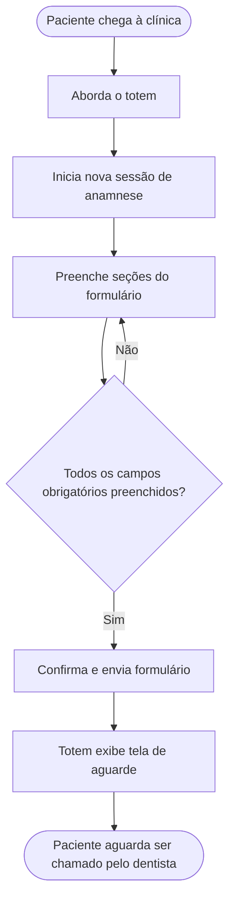
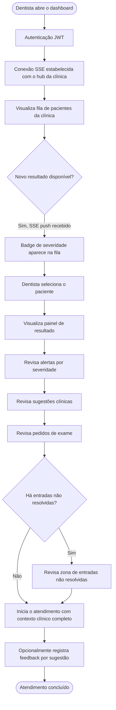
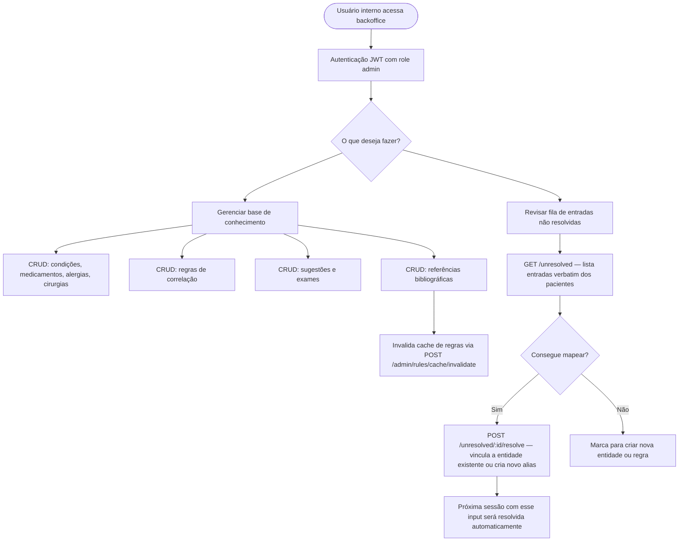
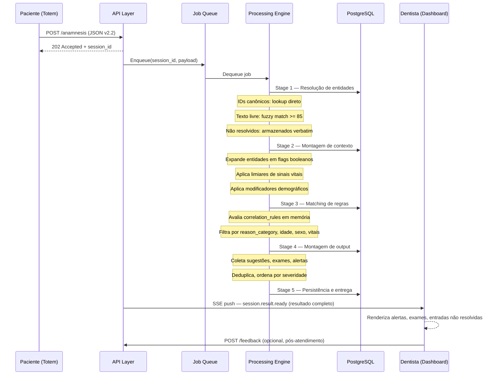

# IAnamnesis — Requisitos de Sistema

> Foco em fluxos de dados e interações com usuários.
> Versão alinhada ao piloto de clínica única.

---

## Usuários do Sistema

| Usuário | Interface | Prioridade no piloto |
|---|---|---|
| Paciente | Totem Android (tela touch) | Alta |
| Dentista | Dashboard Web (browser) | Alta |
| Interno (Equipe Médica) | Backoffice Web + banco direto | Baixa — dados iniciais populados diretamente no banco |

---

## 1. Fluxo do Paciente

### Contexto

O paciente interage exclusivamente com o totem Android instalado na clínica. Não há login, cadastro prévio, ou continuidade entre sessões. Cada visita é uma sessão independente.

### Jornada principal

### Seções do formulário de anamnese

O formulário é dividido em seções apresentadas sequencialmente no totem. A ordem respeita a carga cognitiva do paciente — perguntas simples primeiro, condições específicas depois.

| Seção | Dados coletados | Observações |
|---|---|---|
| Motivo da consulta | `reason_category` (lista pré-definida) + queixa principal em texto livre | Determina o contexto de risco de toda a sessão |
| Contexto do paciente | Idade, sexo, gravidez, tabagismo | Demográficos básicos |
| Pressão arterial | Modo de entrada: medido / sabe se tem / nunca verificou | Três estados distintos — ver detalhe abaixo |
| Glicemia | Modo de entrada: medido / sabe se tem diabetes / nunca verificou | Mesma lógica de três estados |
| Condições sistêmicas | Lista estruturada + campo de texto livre | Cardíaco, respiratório, neurológico, renal/hepático, endócrino, oncológico, musculoesquelético |
| Histórico cardíaco | Cirurgias, marca-passo, arritmias, endocardite | Seção dedicada pela alta relevância odontológica |
| Sangramento / Coagulação | Uso de anticoagulantes, distúrbios de coagulação | |
| Alergias | Lista estruturada + texto livre | |
| Medicamentos em uso | Lista estruturada + dose/frequência | |
| Cirurgias anteriores | Lista estruturada + ano | |
| Observações livres | Campo de texto livre | Qualquer informação adicional que o paciente queira registrar |

### Detalhe: entrada de sinais vitais (três estados)

A maioria dos pacientes não sabe seus valores exatos de pressão ou glicemia, mas sabe se tem a condição. O totem oferece três opções para cada:

**Pressão arterial:**
- "Verificou recentemente e sabe os números" → campos numéricos (sistólica / diastólica)
- "Sabe se tem hipertensão, mas não os números" → Sim / Não
- "Nunca verificou ou não sabe" → nenhuma entrada adicional

**Glicemia:**
- "Verificou em jejum e sabe o valor" → campo numérico
- "Sabe se tem diabetes, mas não o valor" → Sim / Não
- "Nunca verificou ou não sabe" → nenhuma entrada adicional

A opção "nunca verificou" é clinicamente distinta de omitir o campo — ela aciona regras específicas de recomendação de exame.

### Entradas estruturadas vs. texto livre

O totem oferece listas de seleção para condições, medicamentos e alergias comuns. O paciente também pode digitar texto livre quando o item não aparece na lista.

- Entradas estruturadas: resolução direta por ID canônico — zero ambiguidade
- Entradas em texto livre: passam pelo motor de fuzzy matching no backend
- Entradas não reconhecidas: armazenadas verbatim como "não resolvidas" e exibidas ao dentista em zona visual separada

### Pós-envio

Após o envio (`POST /anamnesis`), o totem recebe `202 Accepted` e exibe confirmação. O paciente não vê os resultados da análise — eles são entregues exclusivamente ao dentista.

O totem pode opcionalmente consultar `GET /anamnesis/{session_id}/status` para confirmar que o processamento concluiu, mas não recebe nem exibe alertas clínicos.

---

## 2. Fluxo do Dentista

### Contexto

O dentista acessa o dashboard via browser no seu próprio computador ou workstation da clínica. Não há instalação de software. A conexão SSE é estabelecida ao abrir o dashboard e mantida durante o atendimento.

### Jornada principal

### Dados recebidos pelo dashboard

O resultado entregue via SSE (`session.result.ready`) contém sete seções:

| Seção | Conteúdo | Uso pelo dentista |
|---|---|---|
| `queue_meta` | Identidade do totem, horário de check-in, badge de severidade máxima | Priorização da fila |
| `patient_context` | Grupo etário, sexo, gravidez, tabagismo, vitais em faixa | Contexto rápido do paciente |
| `alerts[]` | Itens críticos/atenção com `triggered_by` + referência bibliográfica | Leitura prioritária antes do procedimento |
| `suggestions[]` | Texto clínico pré-autoria com categoria e racional | Guia de conduta durante o atendimento |
| `exam_suggestions[]` | Pedidos de exame com código TUSS, limiar crítico e ação esperada | Solicitações a emitir antes ou após o procedimento |
| `summary` | Condições, alergias, medicamentos e cirurgias resolvidos | Visão consolidada do perfil do paciente |
| `unresolved_passthrough[]` | Entradas verbatim que não foram mapeadas | Revisão manual obrigatória |

### Hierarquia de severidade dos alertas

| Nível | Cor sugerida | Exemplos |
|---|---|---|
| `CRITICAL` | Vermelho | Crise hipertensiva — deferir procedimento; risco MRONJ; profilaxia endocardite |
| `WARNING` | Amarelo | Vasoconstritor limitado; risco de sangramento; glicemia não controlada |
| `INFO` | Azul | Precauções de posição; xerostomia em idoso; consentimento para fumante |

### Zona de entradas não resolvidas

Entradas que o sistema não conseguiu mapear são exibidas em zona visual distinta, separada dos alertas algorítmicos:

> *"Paciente relatou: '[texto original]' — nenhuma análise automatizada disponível. Revisão manual necessária."*

O dentista deve avaliar manualmente cada entrada não resolvida antes de iniciar o procedimento.

### Fila de pacientes

`GET /queue` retorna a fila ordenada por `queue_position` com o seguinte dado por item:

- `session_id`, `totem_id`, `queue_position`
- `status`: `pending` | `processing` | `ready`
- `appointment_reason` + label legível
- `alert_badge`: `CRITICAL` | `WARNING` | `INFO` | `OK` | `UNRESOLVED_ONLY`
- `check_in_time`

O badge é atualizado em tempo real via SSE quando o processamento conclui.

### Feedback do dentista

Após o atendimento, o dentista pode opcionalmente registrar feedback via `POST /feedback`:

- Por sugestão: `confirmed` | `rejected` | `missing`
- Avaliação geral de utilidade: escala 1–5

Este dado alimenta futuramente o corpus de treinamento para ML (Fase 3).

---

## 3. Fluxo do Usuário Interno (Equipe Médica)

> **Prioridade no piloto: baixa.**
> Para o piloto, os dados iniciais da base de conhecimento serão populados diretamente no banco de dados. O backoffice de autoria não é requisito do piloto.

### Responsabilidades

O usuário interno é responsável por manter a base de conhecimento que sustenta todo o motor de regras. Sem esses dados, o sistema não produz nenhuma saída clínica.

### Dados que devem ser entregues antes do código (pré-piloto)

| Entregável | Quantidade mínima | Formato |
|---|---|---|
| Taxonomia de flags | 30–40 flags | Tabela: flag, descrição, categoria, impacto odontológico |
| Registro de condições | 20+ condições | IDs canônicos, aliases em PT, ICD-10, mapeamento de flags |
| Registro de medicamentos | 50+ medicamentos | Nome genérico PT, nomes comerciais, classe, grupos de alergia, classe ANVISA |
| Registro de alergias | 15+ grupos de alergia | Grupos de reação cruzada, potencial de severidade |
| Regras de correlação | 60–80 regras | Flags gatilho, filtros de consulta, severidade, sugestões vinculadas |
| Catálogo de sugestões | Cobertura das 60–80 regras | Texto em PT clínico, categoria, racional |
| Catálogo de exames | Cobertura dos exames mais críticos | Código TUSS, limiar crítico, ação esperada, texto em PT |
| Referências bibliográficas | Vinculadas às regras | DOI, citação, nível de evidência, trecho relevante em PT |

### Fluxo do backoffice (Fase 2 em diante)

### Loop de melhoria contínua da base de conhecimento

A fila de entradas não resolvidas é o mecanismo central de crescimento orgânico da base de conhecimento:

1. Paciente digita algo que o sistema não reconhece
2. Input é armazenado verbatim e exibido ao dentista
3. Equipe médica revisa periodicamente a fila `GET /unresolved`
4. Para cada entrada: mapeia para entidade existente (novo alias) ou cria nova entidade + regra
5. Na próxima sessão com o mesmo input, o sistema resolve automaticamente

---

## 4. Fluxo de Dados — Visão Integrada

---

## 5. Requisitos por Ator

### 5.1 Paciente

| ID | Requisito | Prioridade |
|---|---|---|
| PAC-01 | O totem deve apresentar o formulário dividido em seções sequenciais com navegação clara entre elas | Alta |
| PAC-02 | Cada seção de sinais vitais deve oferecer exatamente três opções de entrada: valor medido, condição conhecida sem valor, nunca verificado | Alta |
| PAC-03 | Condições, medicamentos e alergias comuns devem ser selecionáveis por lista; texto livre deve ser sempre permitido como alternativa | Alta |
| PAC-04 | O formulário deve funcionar em modo kiosk (tela cheia, sem acesso ao SO Android) | Alta |
| PAC-05 | Após o envio, o totem deve exibir confirmação e voltar à tela inicial após timeout configurável | Alta |
| PAC-06 | O totem não deve exibir resultados clínicos nem alertas em hipótese alguma | Alta |
| PAC-07 | Erros de validação do payload (`400`) devem exibir prompt de nova tentativa ao paciente, sem expor detalhes técnicos | Média |

### 5.2 Dentista

| ID | Requisito | Prioridade |
|---|---|---|
| DEN-01 | O dashboard deve abrir conexão SSE ao carregar e mantê-la ativa durante o uso | Alta |
| DEN-02 | O resultado de uma sessão deve aparecer no dashboard em tempo real, sem necessidade de refresh manual | Alta |
| DEN-03 | A fila deve exibir badge de severidade máxima por paciente antes de o dentista abrir o resultado | Alta |
| DEN-04 | O painel de resultado deve apresentar alertas ordenados: CRITICAL → WARNING → INFO | Alta |
| DEN-05 | Entradas não resolvidas devem ser exibidas em zona visual claramente separada dos alertas algorítmicos | Alta |
| DEN-06 | Cada alerta e sugestão deve indicar as flags que o dispararam e a referência bibliográfica vinculada | Alta |
| DEN-07 | Pedidos de exame devem indicar código TUSS, urgência (`before_procedure` / `at_next_visit` / `routine`) e limiar crítico | Alta |
| DEN-08 | O dentista deve conseguir registrar feedback por sugestão (confirmada / rejeitada / faltando) | Média |
| DEN-09 | O dashboard deve permitir refresh sob demanda via `GET /results/{session_id}` caso a conexão SSE seja perdida | Média |

### 5.3 Usuário Interno

| ID | Requisito | Prioridade |
|---|---|---|
| INT-01 | Para o piloto, toda a base de conhecimento será populada diretamente no banco; nenhuma interface de autoria é requisito desta fase | — |
| INT-02 | A fila de entradas não resolvidas deve ser acessível via `GET /unresolved` autenticado com role admin | Baixa (Fase 2) |
| INT-03 | O backoffice deve suportar CRUD completo para condições, medicamentos, alergias, regras, sugestões, exames e referências | Baixa (Fase 2) |
| INT-04 | Após qualquer edição de regra, o backoffice deve invalidar o cache via `POST /admin/rules/cache/invalidate` | Baixa (Fase 2) |
| INT-05 | O mapeamento de uma entrada não resolvida para uma entidade existente deve criar novo alias automaticamente | Baixa (Fase 2) |

---

## 6. Restrições e Regras de Negócio

| Restrição | Descrição |
|---|---|
| Sem geração de texto | Todas as sugestões, alertas e pedidos de exame são linhas pré-autorizadas pela equipe médica. O sistema é motor de recuperação, não de geração. |
| Rastreabilidade obrigatória | Todo alerta deve ser rastreável à regra que o disparou e à referência bibliográfica que a fundamenta. |
| Entradas não resolvidas nunca são descartadas | Inputs não mapeados são sempre armazenados verbatim e exibidos ao dentista. Nunca são silenciados. |
| `clinicId` nunca é confiado do cliente | O `clinicId` é sempre injetado server-side a partir do token JWT. Nunca provém do payload do totem ou do dashboard. |
| O totem não recebe resultados clínicos | O totem só faz `POST /anamnesis` e opcionalmente consulta status. Não subscreve SSE nem recebe alertas. |
| Isolamento por clínica | Grupos SSE com chave composta (`clinic:{clinicId}:doctor:{doctorId}`) garantem que resultados de uma clínica nunca vazem para outra. |
| Regras avaliadas em memória | As `correlation_rules` são carregadas em cache na inicialização do worker. Nenhuma query de join ocorre em tempo de avaliação de regra. |
